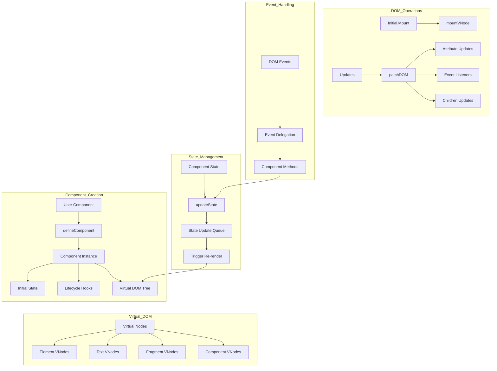
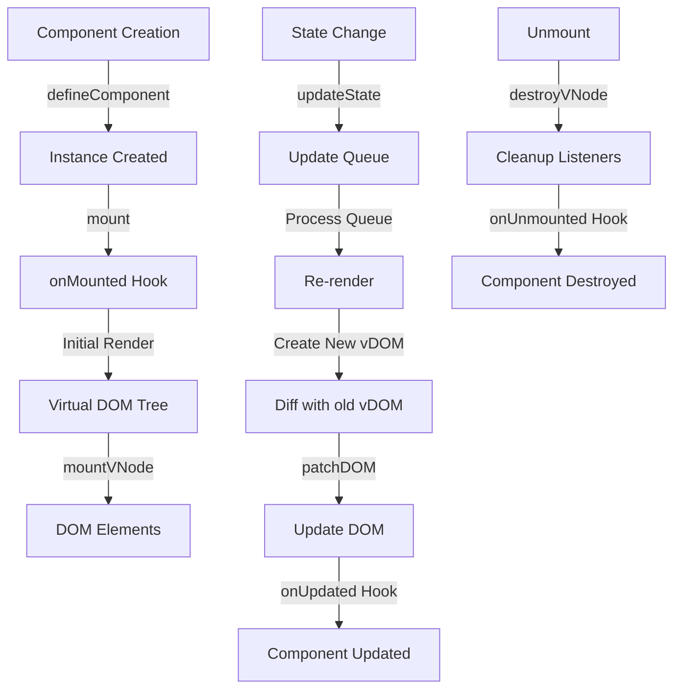
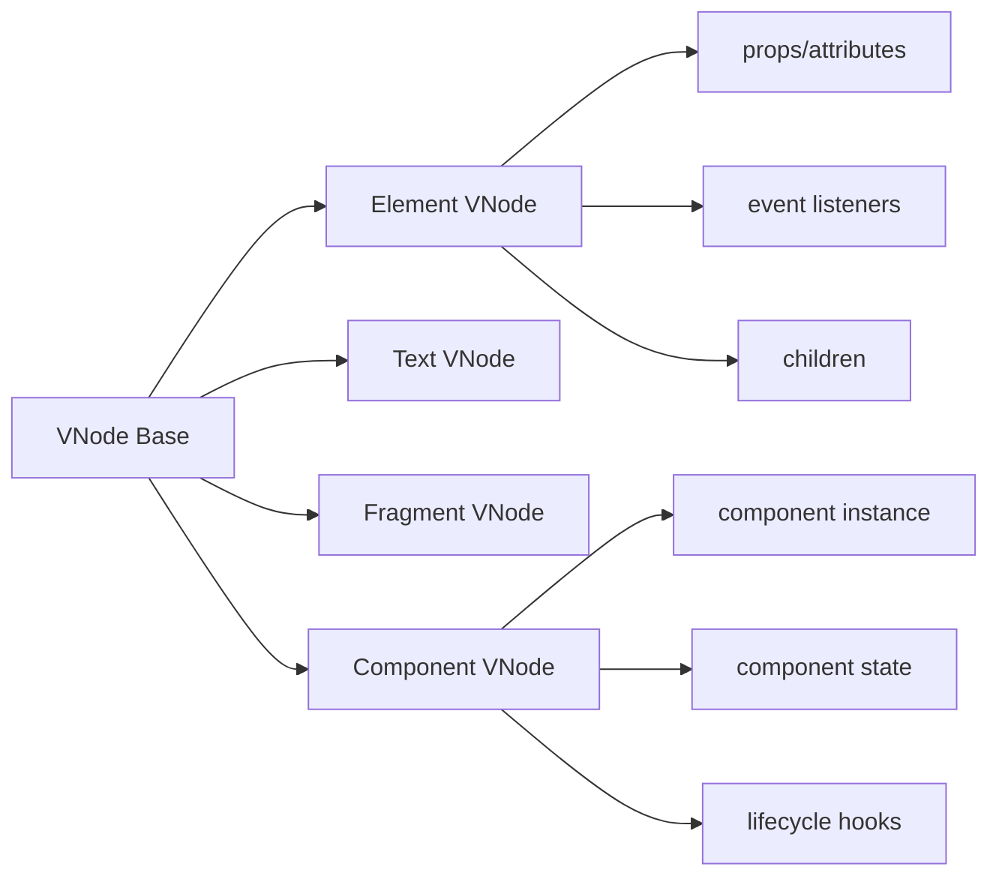

```

   ______     __    __     ______     __           __     ______    
  /\  ___\   /\ "-./  \   /\  __ \   /\ \         /\ \   /\  ___\   
  \ \___  \  \ \ \-./\ \  \ \ \/\ \  \ \ \____   _\_\ \  \ \___  \  
   \/\_____\  \ \_\ \ \_\  \ \_____\  \ \_____\ /\_____\  \/\_____\ 
    \/_____/   \/_/  \/_/   \/_____/   \/_____/ \/_____/   \/_____/ 

```

# What is Smol.js? 

`Smol.js` is yet another smol JavaScript framework for building smol interfaces. TypeScript-flavored, it provides a simple API for defining smol components. Supports both traditional JavaScript/Typescript and JSX/TSX syntax.

`Smol.js` is inspired by good ol' Vue.js, and you will find many common elements and patterns.

<br />

[](https://stackblitz.com/github/Razz21/smoljs/tree/develop?file=README.md&reload=true)

> [!NOTE]
> This project was created mostly for learning purposes. It's not ready for production yet, but if you're the type who enjoys a little adventure and doesn't mind diving into some debugging along the way, you might just enjoy the ride.

### Features
- 🎯 Simple API inspired by Vue.js
- 📦 Light-weight virtual DOM implementation
- 💪 TypeScript support
- ⚡ JSX/TSX support
- 🔄 Reactive state management

# Project Overview

The `Smol.js` project is organized into several packages:

- `packages/runtime`: Contains the core implementation of the framework, including the virtual DOM, component system, and rendering logic.
- `packages/smoljs`: Provides support for JSX and serves as the main entry point for the framework.

# Examples

Check out the examples in the examples directory:

- `examples/benchmark` - Simple rendering performance benchmark.
- `examples/hello-world` - Basic counter example showing the usage of `Smol.js`.
- `examples/jsx-runtime` - Todo app example using JSX syntax and runtime compilation setup.

# Getting Started

To get started with `Smol.js`, you can clone the repository and run the examples provided.
Alternatively you can click the `Open in StackBlitz` button above to start coding right away.

Prerequisites:

```shell
pnpm install

pnpm build:packages
```

To run the `hello-world` example run the following commands:

```shell
cd examples/hello-world

pnpm dev
```

# Examples

## Basic Usage

```typescript
// components/App.ts

import { createApp, defineComponent, h } from 'smoljs';

const HelloWorld = ({ message }: { message: string }) => {
  return h('div', null, [message]);
};

const App = defineComponent({
  render() {
    return h(HelloWorld, { message: 'Hello, World!' });
  },
});

createApp(App).mount(document.querySelector('#app'));
```

## JSX Usage

```tsx
// components/App.tsx

import { createApp, defineComponent, h } from 'smoljs';

const HelloWorld = ({ message }: { message: string }) => {
  return <div>{message}</div>;
};

const App = defineComponent({
  render() {
    return <HelloWorld message="Hello, World!" />;
  },
});

createApp(App).mount(document.querySelector('#app'));
```

> [!NOTE]
> Check out [`package/runtime`](/packages/runtime/) for more details on the runtime implementation.

# Architecture Overview

Smol.js is built with a modular architecture focused on three main concepts:

### Virtual DOM System
Implements an efficient DOM manipulation layer through virtual node diffing:
- Virtual node creation via [`h()`](packages/runtime/src/h.ts) and [`hFragment()`](packages/runtime/src/h.ts)
- DOM mounting through [`mountVNode()`](packages/runtime/src/mount-dom.ts)
- Efficient updates via [`patchDOM()`](packages/runtime/src/patch-dom/patch-dom.ts)
- Removal and cleanup of nodes with [`destroyVNode()`](packages/runtime/src/destroy-vnode.ts) 

### Component System
Provides the component abstraction layer:
- Class components via [`defineComponent()`](packages/runtime/src/component/component.ts)
- Function components support 
- State management and lifecycle hooks
- Event handling and delegation

### Runtime System
Handles the core runtime operations:
- Virtual DOM diffing and reconciliation
- Component instance management
- Event delegation system
- Props and attributes management

## Core Components & Data Flow



## Component Lifecycle Flow



## Virtual DOM Node Types & Relations



### Key Relations and Dependencies

1. Component to Virtual DOM

- Components create Virtual DOM trees through `render()`
- Each Virtual DOM node links to actual DOM via `el` property
- Component instances are stored in Component VNodes

2. State to DOM Updates

- State changes trigger component re-renders
- New Virtual DOM tree is created
- Diff algorithm determines minimal updates
- [`patchDOM`](packages/runtime/src/patch-dom/patch-dom.ts) applies changes to real DOM

3. Event Handling Chain

- DOM events bubble up through Virtual DOM tree
- Events delegated to correct component instance
- Component methods handle events
- State updates trigger re-render cycle

4. Lifecycle Hooks Integration

- `onMounted`: After initial DOM mounting
- `onUpdated`: After DOM patch operations
- `onUnmounted`: Before component destruction

5. Props & Children Flow

- Props pass down through component tree
- Children managed through Virtual DOM hierarchy
- Updates to props trigger component re-renders

# License

MIT © Razz21
